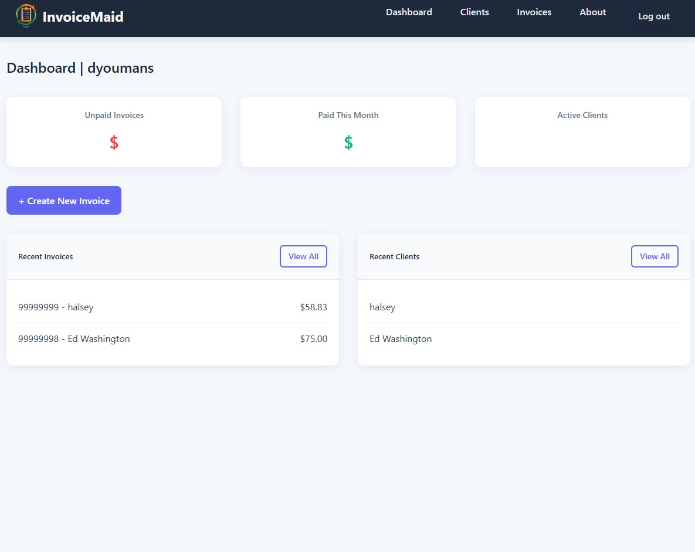

# InvoiceMaid

## About

InvoiceMaid is a modern, Django-based invoice management system designed specifically for freelancers and small businesses. I built this application to simplify the invoicing process after struggling with overly complex accounting software that offered far more features than I needed as a freelancer.

This application helps users manage clients, create professional invoices, track payments, and maintain financial records without the steep learning curve of enterprise-level solutions.

## Getting Started

- **Live Demo**: [InvoiceMaid App](https://invoicemaid-2681961b5215.herokuapp.com/)
- **Project Planning**: [Trello Board](https://trello.com/b/YN5pnvzv/invoice)

## Features

* Client management
* Invoice creation and tracking
* Dynamic invoice item management
* Tax calculation
* Payment status tracking
* User authentication and authorization
* Responsive design for mobile and desktop

## Usage

### Creating Invoices

1. Log in to your account
2. Navigate to "New Invoice"
3. Select a client or create a new one
4. Add invoice items using the "Add Another Item" button
5. Set tax rate if applicable
6. Save the invoice

### Managing Clients

1. Navigate to "Clients"
2. View all clients or add a new client
3. Edit client details as needed

## Technologies Used

* **Backend**: Python 3.9, Django 4.2
* **Frontend**: HTML5, CSS3, JavaScript
* **Database**: SQLite (development), PostgreSQL (production)
* **Deployment**: Heroku
* **Authentication**: Django Authentication System
* **Version Control**: Git, GitHub

## Next Steps

Future enhancements planned for InvoiceMaid include:

1. Email integration to send invoices directly to clients
2. Dashboard analytics to visualize income trends
3. Recurring invoice automation
4. Integration with payment processors (Stripe, PayPal)
5. Multi-currency support for international clients

## Contributing

1. Fork the repository
2. Create your feature branch (`git checkout -b feature/amazing-feature`)
3. Commit your changes (`git commit -m 'Add some amazing feature'`)
4. Push to the branch (`git push origin feature/amazing-feature`)
5. Open a Pull Request

## Attributions
* Invoice to pdf instructions from [Weasyprint](https://pypi.org/project/weasyprint/)
* Stylesheets inspired by [W3Schools](https://www.w3schools.com/)